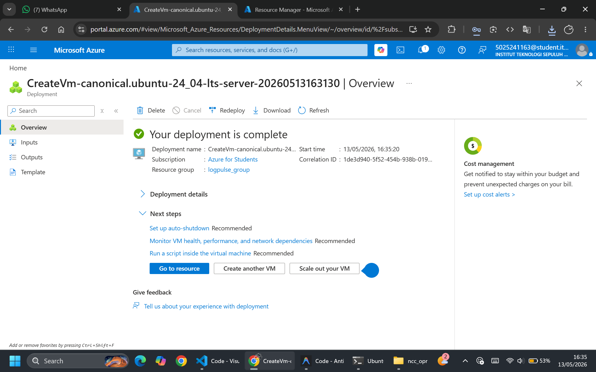
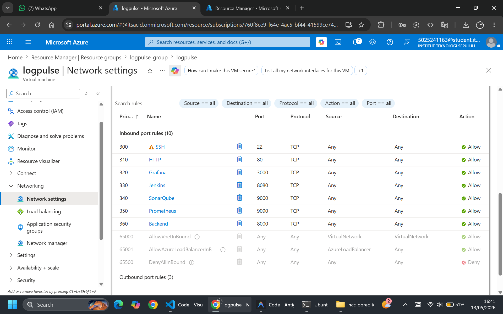
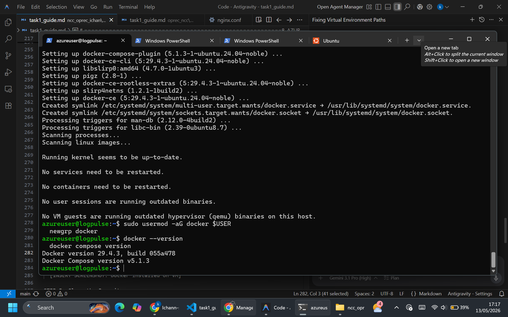
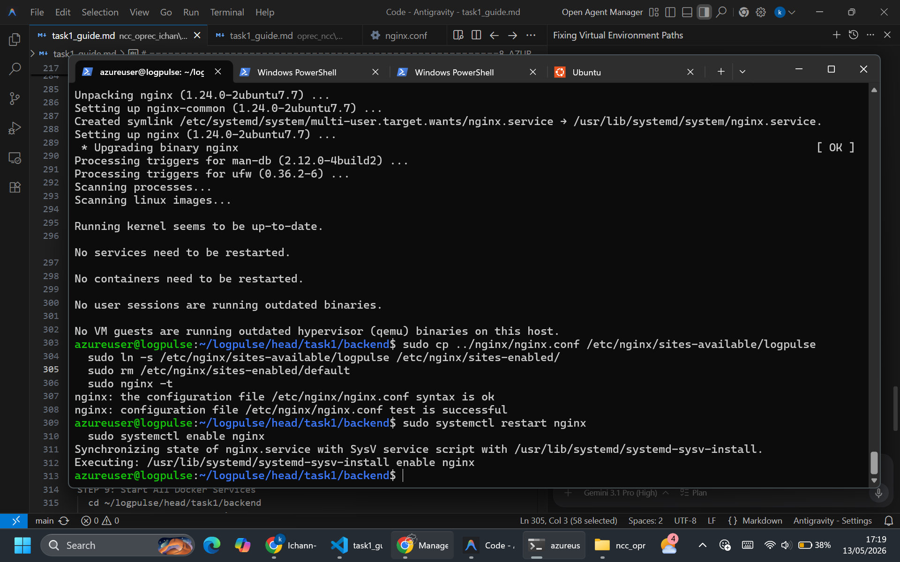
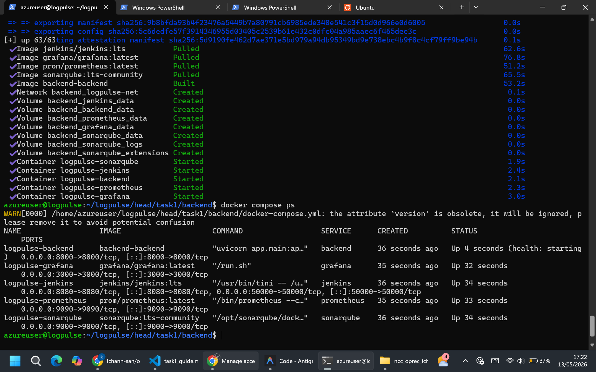
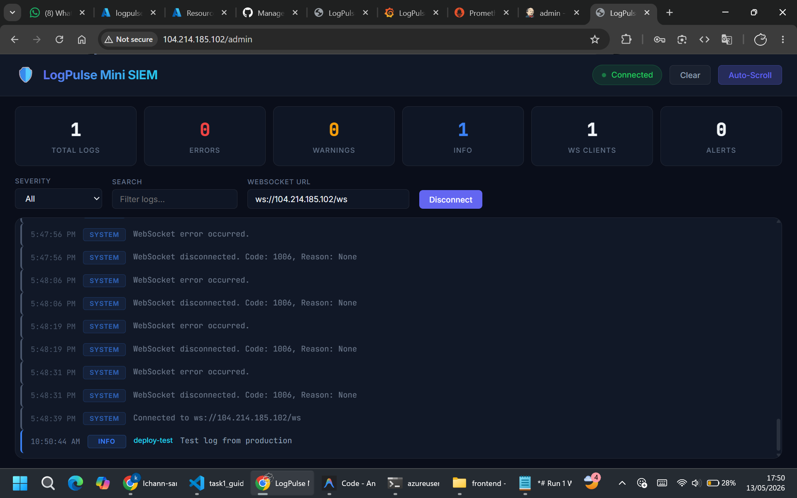
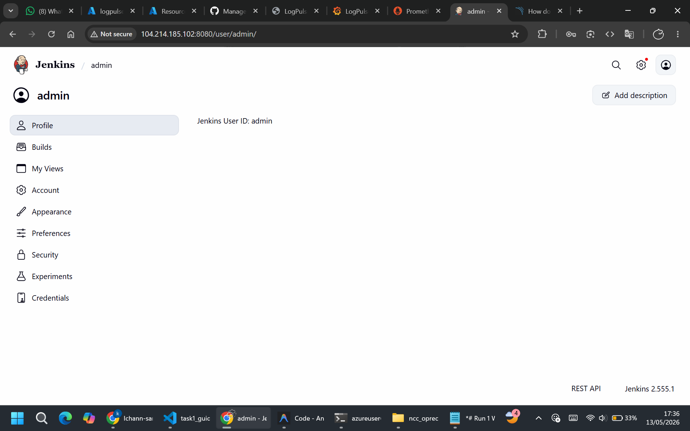
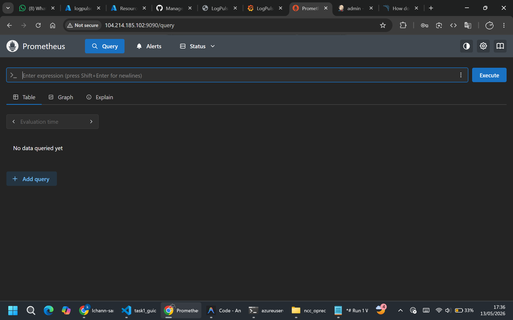
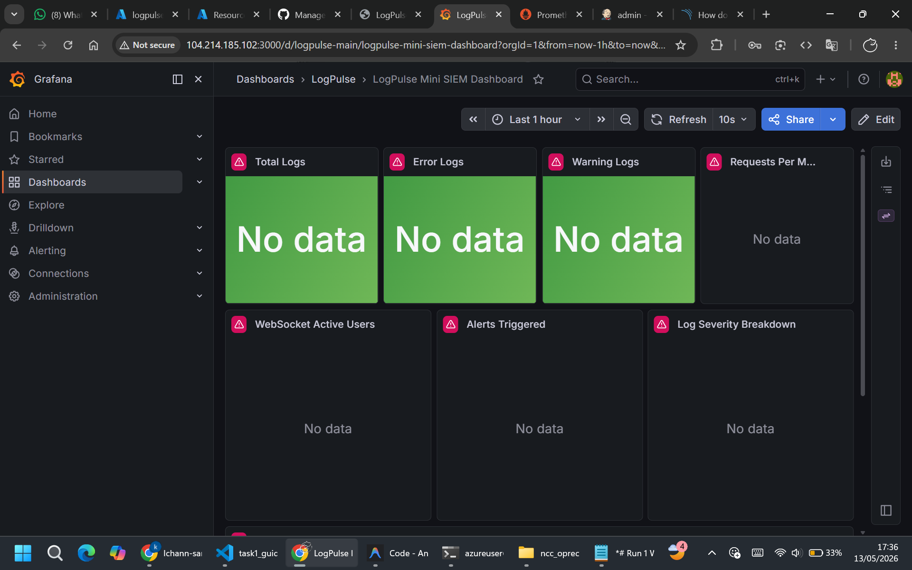

========================================================
LOGPULSE MINI SIEM — TASK 1 DOCUMENTATION
Backend + Docker + Azure VPS Deployment
========================================================

TABLE OF CONTENTS
--------------------------------------------------------
1. Task Overview
2. Requirements
3. Backend Architecture
4. API Endpoints
5. Rule Engine Workflow
6. Database Schema
7. Docker Configuration
8. Azure VPS Deployment Tutorial
9. Nginx Reverse Proxy
10. Verification Steps
11. Screenshots

========================================================
1. TASK OVERVIEW
========================================================

Task 1 covers the core application layer:
  - FastAPI backend with REST + WebSocket endpoints
  - Rule-based log parser with severity classification
  - SQLite database for persistent log storage
  - Prometheus-compatible metrics endpoint
  - Docker containerization (multi-stage build)
  - Azure VPS deployment with Nginx reverse proxy

Key deliverables:
  - Functional backend serving /health, /logs, /ws, /metrics
  - Dockerfile with multi-stage build and HEALTHCHECK
  - docker-compose.yml orchestrating all services
  - Nginx reverse proxy configuration
  - Public VPS deployment

========================================================
2. REQUIREMENTS
========================================================

Software:
  - Python 3.11+
  - Docker Desktop (with Docker Compose v2)
  - Git

Python Packages (requirements.txt):
  - fastapi==0.115.0
  - uvicorn[standard]==0.30.0
  - aiofiles==24.1.0
  - jinja2==3.1.4
  - aiosqlite==0.20.0
  - httpx==0.27.0
  - pydantic==2.9.0

========================================================
3. BACKEND ARCHITECTURE
========================================================

  main.py (entry point)
      │
      ├── routes/
      │   ├── health.py      → GET /health
      │   ├── logs.py        → POST /logs, GET /logs
      │   └── websocket.py   → WS /ws
      │
      ├── services/
      │   ├── parser_service.py     → log parsing + rule engine
      │   ├── metrics_service.py    → Prometheus counters
      │   └── websocket_service.py  → WS connection manager
      │
      ├── models/
      │   └── log_model.py   → Pydantic schemas
      │
      ├── database/
      │   └── sqlite.py      → async SQLite CRUD
      │
      └── rules/
          └── rules.json     → keyword-severity mappings

Startup Flow:
  1. FastAPI app created with lifespan handler
  2. CORS middleware added (allow all origins)
  3. Routes registered (health, logs, websocket)
  4. Database initialized (creates table if not exists)
  5. Static files mounted
  6. Uvicorn serves on port 8000

========================================================
4. API ENDPOINTS
========================================================

GET /health
  - Returns: { status, service, timestamp }
  - Used by: Docker HEALTHCHECK, monitoring

POST /logs
  - Body: { message: string, source: string }
  - Process:
      1. Parse message through rule engine
      2. Store in SQLite
      3. Update Prometheus metrics
      4. Broadcast to WebSocket clients
      5. Send Discord alert if ERROR
  - Returns: { status, event: LogEvent }

GET /logs
  - Query params: severity, source, keyword, limit, offset
  - Returns: { status, count, logs[] }

WS /ws
  - WebSocket endpoint for real-time streaming
  - Supports multiple concurrent clients
  - Broadcasts all new log events as JSON

GET /metrics
  - Prometheus text exposition format
  - Counters: total_logs, error_logs, warning_logs,
    info_logs, websocket_clients, request_count, alert_count

GET /stats
  - Same metrics as /metrics but in JSON format

========================================================
5. RULE ENGINE WORKFLOW
========================================================

  Incoming log message
      │
      ▼
  Convert to lowercase
      │
      ▼
  Iterate through rules.json
      │
      ├── Match found?
      │   ├── YES → Assign rule severity
      │   │         Set is_alert = true (if ERROR/WARNING)
      │   │         Record rule_matched description
      │   │
      │   └── NO  → Default severity = INFO
      │             is_alert = false
      │
      ▼
  Return parsed event

Rules defined in rules.json:
  - "failed"       → ERROR
  - "error"        → ERROR
  - "denied"       → WARNING
  - "disconnect"   → WARNING
  - "timeout"      → ERROR
  - "unauthorized" → ERROR
  - "forbidden"    → ERROR
  - "warning"      → WARNING
  - "critical"     → ERROR
  - "success"      → INFO
  - "started"      → INFO
  - "connected"    → INFO

========================================================
6. DATABASE SCHEMA
========================================================

Table: logs

  Column    │ Type     │ Description
  ──────────┼──────────┼─────────────────────
  id        │ INTEGER  │ Auto-increment PK
  timestamp │ TEXT     │ UTC ISO timestamp
  severity  │ TEXT     │ INFO, WARNING, ERROR
  source    │ TEXT     │ Log source identifier
  message   │ TEXT     │ Raw log message

Operations:
  - init_db()    → Creates table if not exists
  - insert_log() → Inserts and returns row ID
  - get_logs()   → Filtered query with pagination
  - get_log_count() → Total count

========================================================
7. DOCKER CONFIGURATION
========================================================

Dockerfile (Multi-Stage Build):
  Stage 1 — Builder:
    - Base: python:3.11-slim
    - Creates /opt/venv
    - Installs all pip dependencies

  Stage 2 — Runtime:
    - Base: python:3.11-slim (clean image)
    - Copies only /opt/venv from builder
    - Copies app/ source code
    - Creates /app/data for SQLite
    - HEALTHCHECK: hits /health every 30s
    - CMD: uvicorn on port 8000

docker-compose.yml Services:
  1. backend       — LogPulse FastAPI (port 8000)
  2. prometheus    — Metric collection (port 9090)
  3. grafana       — Dashboards (port 3000)
  4. sonarqube     — Code quality (port 9000)
  5. jenkins       — CI/CD (port 8080)

.dockerignore:
  Excludes: venv/, __pycache__/, *.db, .env,
            .git/, Dockerfile, docker-compose.yml

Environment Variables (.env):
  LOGPULSE_DB_PATH=/app/data/logpulse.db
  DISCORD_WEBHOOK_URL=https://discord.com/api/webhooks/1440483607456882699/iF8bC7o2K8_o92L0yWk05243K94d79hH6qR5p0L44oG8sN9lP2eD4oD2qG3o0u7D8nE
  GRAFANA_ADMIN_USER=admin
  GRAFANA_ADMIN_PASSWORD=admin

========================================================
8. AZURE VPS DEPLOYMENT TUTORIAL
========================================================

STEP 1: Create Azure VM
  1. Log in to Azure Portal (portal.azure.com)
  2. Click "Create a resource" → "Virtual Machine"
  3. Configuration:
     - Resource group: logpulse-rg (create new)
     - VM name: logpulse-vm
     - Region: Southeast Asia (or closest to you)
     - Image: Ubuntu Server 22.04 LTS
     - Size: Standard_B2s (2 vCPU, 4 GB RAM) minimum
     - Authentication: SSH public key
     - Username: azureuser
  4. Click "Review + Create" → "Create"
  5. Download the SSH key (.pem file)

STEP 2: Configure Network Security Group (NSG)
  1. Go to your VM → Networking → Add inbound port rule
  2. Add these rules:

     Port  │ Protocol │ Name
     ──────┼──────────┼──────────────
     80    │ TCP      │ HTTP
     3000  │ TCP      │ Grafana
     8080  │ TCP      │ Jenkins
     9000  │ TCP      │ SonarQube
     9090  │ TCP      │ Prometheus
     8000  │ TCP      │ Backend

STEP 3: SSH into the VM
  Open PowerShell:

  ssh -i C:/Users/khalisya/Code/oprec_ncc/Ichan.pem azureuser@104.214.185.102

STEP 4: Install Docker on Ubuntu
  Run these commands on the VM:

  sudo apt update && sudo apt upgrade -y

  sudo apt install -y apt-transport-https ca-certificates \
    curl gnupg lsb-release

  curl -fsSL https://download.docker.com/linux/ubuntu/gpg \
    | sudo gpg --dearmor -o /usr/share/keyrings/docker-archive-keyring.gpg

  echo "deb [arch=$(dpkg --print-architecture) \
    signed-by=/usr/share/keyrings/docker-archive-keyring.gpg] \
    https://download.docker.com/linux/ubuntu \
    $(lsb_release -cs) stable" | sudo tee \
    /etc/apt/sources.list.d/docker.list > /dev/null

  sudo apt update
  sudo apt install -y docker-ce docker-ce-cli containerd.io \
    docker-compose-plugin

  sudo usermod -aG docker $USER
  newgrp docker

  Verify:
  docker --version
  docker compose version

STEP 5: Clone the Repository
  git clone https://github.com/Ichann-san/oprec_ncc.git logpulse
  cd logpulse

STEP 6: Configure Environment
  cd head/task1/backend
  nano .env

  Update:
    DISCORD_WEBHOOK_URL=https://discord.com/api/webhooks/1440483607456882699/iF8bC7o2K8_o92L0yWk05243K94d79hH6qR5p0L44oG8sN9lP2eD4oD2qG3o0u7D8nE
    GRAFANA_ADMIN_PASSWORD=admin

STEP 7: Install and Configure Nginx
  sudo apt install -y nginx
  sudo cp ../nginx/nginx.conf /etc/nginx/sites-available/logpulse
  sudo ln -s /etc/nginx/sites-available/logpulse /etc/nginx/sites-enabled/
  sudo rm /etc/nginx/sites-enabled/default
  sudo nginx -t
  sudo systemctl restart nginx
  sudo systemctl enable nginx

STEP 8: Copy Frontend Files to Nginx
  sudo mkdir -p /usr/share/nginx/html
  sudo cp ../../task4/frontend/* /usr/share/nginx/html/

STEP 9: Start All Docker Services
  cd ~/logpulse/head/task1/backend
  docker compose up -d --build

  Wait 1-2 minutes for all services to start.

  docker compose ps

STEP 10: Verify Public Access
  From your local machine, test:

  http://104.214.185.102/              → Frontend dashboard
  http://104.214.185.102/health        → Backend health check
  http://104.214.185.102:3000          → Grafana
  http://104.214.185.102:9090          → Prometheus
  http://104.214.185.102:8080          → Jenkins
  http://104.214.185.102:9000          → SonarQube

========================================================
9. NGINX REVERSE PROXY
========================================================

Configuration file: task1/nginx/nginx.conf

Routing:
  /              → Static frontend files (index.html)
  /health        → Proxy to backend:8000
  /logs          → Proxy to backend:8000
  /metrics       → Proxy to backend:8000
  /stats         → Proxy to backend:8000
  /ws            → Proxy to backend:8000 (WebSocket upgrade)

WebSocket specific headers:
  - Upgrade: $http_upgrade
  - Connection: "upgrade"
  - Timeout: 86400s (24 hours)

Proxy headers on all routes:
  - X-Real-IP
  - X-Forwarded-For
  - X-Forwarded-Proto

========================================================
10. VERIFICATION STEPS
========================================================

After deployment, verify each component:

1. Backend Health:
   curl http://104.214.185.102/health
   Expected: {"status":"ok","service":"LogPulse Mini SIEM",...}

2. Log Ingestion:
   curl -X POST http://104.214.185.102/logs \
     -H "Content-Type: application/json" \
     -d '{"message":"Test log from production","source":"deploy-test"}'
   Expected: {"status":"received","event":{...}}

3. Metrics:
   curl http://104.214.185.102/metrics
   Expected: Prometheus text format with logpulse_* counters

4. WebSocket:
   Open dashboard at http://104.214.185.102/
   Click Connect → status should be green
   Send a log → should appear in real-time

5. Prometheus:
   Open http://104.214.185.102:9090/targets
   Expected: logpulse-backend target shows "UP"

6. Grafana:
   Open http://104.214.185.102:3000
   Login → Dashboard should show metrics

========================================================
11. SCREENSHOTS
========================================================

========================================================
END OF TASK 1 DOCUMENTATION
========================================================
